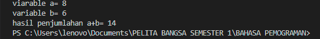

# lab2py
## Langkah-Langkah Praktikum
### Latihan 1
Untuk Menampilkan tulisan di layar dapat menggunakan syntax `print` dan diikuti dengan tanda kutip `"` kata yang ingin ditampilkan dan ditutup dengan tanda kutip lagi `"`setelah syntax `print` seperti gambar dibawah ini.

### Latihan 2
Untuk Menjumlahkan dua buah bilangan menggunakan variabel a dan b buat variabel a dengan nilai 8 dan variabel dengan nilai 6 ikuti seperti gambar yang ada di bawah ini.

Hasil dari tampilan yang sudah dibuat

### Latihan 3
Penggunaan syntax input berfungsi untuk mengambil nilai variabel dari keyboard masukkan variabel telebih dahulu kemudian diikuti dengan syntax `input` dan masukkan nilai yang di inginkan seperti gambar dibawah ini.

Hasil dari tampilan yang sudah dibuat

SELESAI.